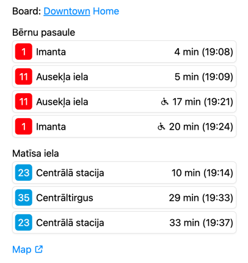

# satiksme

This repository contains:

1. A Go client to retrieve realtime public transport departure times for Riga public transport authority's (Rīgas
   Satiksme) stops.
2. A web app that to display upcoming departures for predefined stops and lines.

The library uses the API consumed by [Rīgas Satiksme's frontend](https://saraksti.lv) and parses the data into a
easy-to-consume data structure.

### Web app usage



First, create a configuration file based on [the example file](cmd/satiksme/example.yaml) and fill in the desired stops
and lines. Stop IDs can be found in the aforementioned website.

Then, install the binary:

```shell
go install github.com/gstvr/satiksme/cmd/satiksme
```

Finally, run it:

```shell
satiksme --port 8080 --config /path/to/config.yaml
```

### Client usage

Make sure to pull the package:

```shell
go get github.com/gstvr/satiksme
```

```go
package main

import (
	// ...
	"github.com/gstvr/satiksme"
)

func main() {
	c, err := satiksme.NewClient()
	// handle err

	stopDepartures, err := c.GetStopDepartures(context.Background(), []string{"3100"})
	// handle err

	for _, stop := range stopDepartures {
		fmt.Printf("Stop ID: %s\n", stop.StopID)

		for _, dep := range stop.Departures {
			fmt.Printf("  ")
			fmt.Printf("Line: %s ", dep.Line.Name())
			fmt.Printf("Destination: %s ", dep.Destination)
			fmt.Printf("Departs At: %s ", dep.DepartsAt.Format(time.TimeOnly))
			fmt.Printf("Vehicle ID: %s ", dep.VehicleID)
			fmt.Printf("Flags: %v\n", dep.Flags)
		}
	}
}
```
